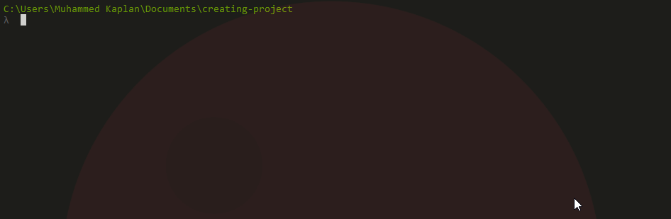

### Before you begin you'll need an authentication key from Choban to be able push your packages..

You will need authentication key to push your package, register [here](https://choban.herokuapp.com/register). Then go to [Choban packages page](https://choban.herokuapp.com/packages/) and login, then click to your name and click 'Get API Token'

After you got your API Token, type


```markdown
chob --authenticate <Api Token>
```

